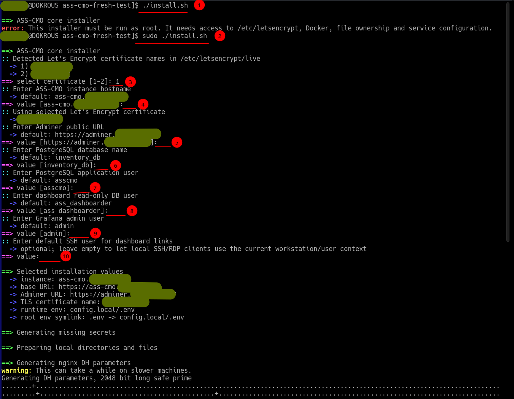
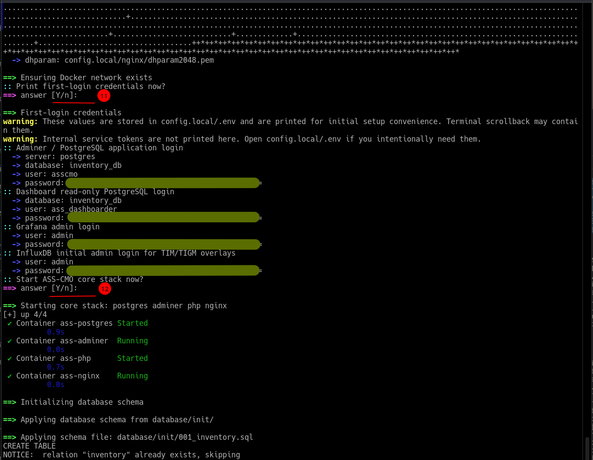

# ASS-CMO Installation

This guide describes the supported, installer-first way to deploy ASS-CMO and enroll agents.

For operational checks and failure diagnosis, see **[TROUBLESHOOTING.md](TROUBLESHOOTING.md)**.
For the security model and exposure guidance, see **[SECURITY.md](SECURITY.md)**.

## Contents

1. [Requirements](#requirements)
2. [Deployment model](#deployment-model)
3. [Quick install](#quick-install)
4. [What the installer asks for](#what-the-installer-asks-for)
5. [What the installer creates](#what-the-installer-creates)
6. [First login and verification](#first-login-and-verification)
7. [Where configuration lives](#where-configuration-lives)
8. [Agent enrollment](#agent-enrollment)
9. [Client URI handlers](#client-uri-handlers)
10. [Updates](#updates)
11. [Backup](#backup)

---

## Requirements

Server:

- Linux host
- Docker with the Docker Compose plugin
- Git
- Valid DNS records pointing to the server
- A valid TLS certificate — for example from Let's Encrypt — that already exists before running the installer

The nginx container mounts `/etc/letsencrypt` from the host. The installer looks for existing certificate names in `/etc/letsencrypt/live/` and prompts to select one. It does not automate DNS or certificate issuance.

Ports 80 and 443 must be reachable from managed hosts for agent inventory uploads and client access.

> The first public version of the installer expects certificates from Let's Encrypt. This may change before the stable 1.0.0 release.

---

## Deployment model

ASS-CMO is designed for internal, trusted-network use: a private LAN, a VPN, or a reverse proxy restricted by source-IP allowlists. The dashboard and Adminer are administrative tools and should not be exposed directly to the internet.

The recommended exposure model, including how to safely collect inventory from remote sites, is documented in [SECURITY.md](SECURITY.md).

---

## Quick install

Clone the repository:

```bash
git clone https://github.com/kopfik/ass-cmo
cd ass-cmo
```

Run the installer as root:

```bash
sudo ./install.sh
```

The installer is interactive. It detects Let's Encrypt certificates and offers a list of available certs, prompts for the instance hostname, database names, TLS certificate name, and optional SSH user, then confirms before starting containers. All generated secrets are stored only in `config.local/.env` and are never committed.

On a reinstall, the installer keeps existing values and only fills in missing or weak ones.

<picture>
  <source media="(prefers-color-scheme: light)" srcset="docs/images/install/light/01-installer-prompts.png">
  
</picture>

The numbered markers in the screenshots highlight terminal prompts where the operator provides input. They are not the same as the numbered installer behavior list below.

---

## What the installer asks for

- Instance hostname (for example `ass-cmo.example.com`) and Adminer URL.
- TLS certificate name, selected from `/etc/letsencrypt/live/`.
- PostgreSQL database and user names.
- Optional default SSH user for generated connection links.
- Confirmation before the core containers are started.

---

## What the installer creates

On a fresh install, the installer:

1. Creates `config.local/` with all required subdirectories.
2. Copies `.env.example` to `config.local/.env` if not already present.
3. Creates a root `.env` symlink pointing to `config.local/.env` for compose compatibility.
4. Copies example nginx configuration to `config.local/nginx/` and dashboard view templates to `config.local/dashboard-views/`.
5. Generates strong random secrets for enrollment, the application DB password, and the dashboard read-only DB password. Existing strong values are preserved on reinstall.
6. Generates Diffie-Hellman parameters for nginx TLS (can take a few minutes on slow machines).
7. Creates the external Docker network (`ass-net`) if not already present.
8. Optionally starts the core stack: `postgres adminer php nginx`.
9. Waits for PostgreSQL to be ready, then applies the core database schema from `database/init/*.sql` idempotently.
10. Creates and configures the read-only dashboard database role (`POSTGRES_DASHBOARD_USER`).
11. Optionally prints first-login credentials.

The installer sets up only the core stack. Experimental optional overlays are not part of the supported install and are not configured.

<picture>
  <source media="(prefers-color-scheme: light)" srcset="docs/images/install/light/02-credentials-and-start.png">
  
</picture>

---

## First login and verification

Check that the core containers are running:

```bash
docker compose ps
```

Expected running containers:

```text
ass-postgres
ass-adminer
ass-php
ass-nginx
```

<picture>
  <source media="(prefers-color-scheme: light)" srcset="docs/images/install/light/03-finished-and-verify.png">
  
</picture>

Open the dashboard at your configured hostname, for example `https://ass-cmo.example.com/`.

### Adminer login

Adminer is the web-based database admin UI. Open your configured Adminer URL, for example `https://adminer.example.com/`, and use:

```text
System:   PostgreSQL
Server:   postgres
Username: value of POSTGRES_USER from config.local/.env
Password: value of POSTGRES_PASSWORD from config.local/.env
Database: value of POSTGRES_DB from config.local/.env
```

If the dashboard, database, or endpoints do not behave as expected, see [TROUBLESHOOTING.md](TROUBLESHOOTING.md) for container, nginx, database, and schema checks.

---

## Where configuration lives

All runtime configuration is kept under `config.local/`, which is intentionally not committed:

```text
config.local/.env                 runtime environment and secrets
config.local/nginx/               active nginx configuration
config.local/dashboard-views/     dashboard SQL views (one page per .sql file)
config.local/sites.json           network sites and subnet definitions
config.local/backups/             local backups
```

The root `.env` is a symlink to `config.local/.env` for Docker Compose compatibility.

After changing values that the PHP container reads (for example a default SSH user), recreate the container:

```bash
docker compose up -d --force-recreate php
```

---

## Agent enrollment

Agents are inventory-only. They report system state to the server and never receive commands from it. Each agent authenticates with a per-host secret that is created locally on the managed host during enrollment.

Enrollment is a two-phase flow: the installer initiates a pending request and displays a pairing code on the managed host console, then the administrator approves the request in the dashboard (`?view=enrollment`). After approval, the per-host secret is written into the agent's local config.

### Linux agent

Run as root on the managed Linux host (replace the hostname):

```bash
BASE_URL="https://ass-cmo.example.com"; tmp="$(mktemp)" && trap 'rm -f "$tmp"' EXIT && curl -fsSL "$BASE_URL/agents/linux/install-ass-cmo-agent.sh" -o "$tmp" && sh "$tmp" --base-url "$BASE_URL"
```

For a fresh host, the installer starts an enrollment request and waits for admin approval. For a host that already has `/etc/ass-cmo/agent.conf`, the installer updates the agent files and runs an inventory report immediately. A successful report prints:

```text
OK - Inventory updated for UID: ...
```

Files installed on a managed Linux host:

```text
/etc/ass-cmo/agent.conf
/usr/local/sbin/ass-cmo-agent
/etc/systemd/system/ass-cmo-agent.service
/etc/systemd/system/ass-cmo-agent.timer
```

Distribution package hooks, where applicable:

```text
/etc/apt/apt.conf.d/99ass-cmo-agent        (Debian / Ubuntu / Proxmox / PBS / PMG / PDM / OMV)
/etc/pacman.d/hooks/ass-cmo-agent.hook     (Arch Linux)
```

The default timer runs 30 seconds after boot and at 00:01 and 12:01. For larger fleets, consider adding a randomized delay in the timer unit to spread server load.

To remove the Linux agent, run as root:

```bash
systemctl disable --now ass-cmo-agent.timer 2>/dev/null || true
rm -f /etc/systemd/system/ass-cmo-agent.timer /etc/systemd/system/ass-cmo-agent.service /usr/local/sbin/ass-cmo-agent /etc/ass-cmo/agent.conf /etc/apt/apt.conf.d/99ass-cmo-agent /etc/pacman.d/hooks/ass-cmo-agent.hook
systemctl daemon-reload
```

### Windows agent

Run PowerShell as Administrator (replace the hostname):

```powershell
$BaseUrl = "https://ass-cmo.example.com"; Invoke-WebRequest -UseBasicParsing "$BaseUrl/agents/windows/install-ass-cmo-agent.ps1" -OutFile "$env:TEMP\install-ass-cmo-agent.ps1"; powershell.exe -NoProfile -ExecutionPolicy Bypass -File "$env:TEMP\install-ass-cmo-agent.ps1" -BaseUrl "$BaseUrl"
```

A fresh Windows enrollment starts without local config, displays a pairing code on the console, and writes `%ProgramData%\ASS-CMO\agent.conf.ps1` after admin approval. An existing local config is kept on reinstall. The installer creates the scheduled task `ASS-CMO-Agent` and runs the first inventory report immediately.

Files installed:

```text
C:\ProgramData\ASS-CMO\agent.conf.ps1
C:\ProgramData\ASS-CMO\ass-cmo-agent.ps1
```

To remove the Windows agent, run PowerShell as Administrator:

```powershell
Invoke-WebRequest -UseBasicParsing "https://ass-cmo.example.com/agents/windows/uninstall-ass-cmo-agent.ps1" -OutFile "$env:TEMP\uninstall-ass-cmo-agent.ps1"; powershell.exe -NoProfile -ExecutionPolicy Bypass -File "$env:TEMP\uninstall-ass-cmo-agent.ps1"
```

Add `-KeepConfig` to keep the local config file.

For agent verification commands and report failures, see [TROUBLESHOOTING.md](TROUBLESHOOTING.md).

---

## Client URI handlers

The dashboard generates client-side connection links such as `assssh://10.20.30.10` and `assrdp://10.20.30.20`. ASS-CMO does not store SSH keys, RDP passwords, or remote credentials — the workstation handles these links through registered URI handlers.

Linux desktop installer:

```bash
curl -fsSL https://ass-cmo.example.com/agents/handlers/linux/install-ass-cmo-uri-handlers.sh | sh
```

Windows installer:

```powershell
Invoke-WebRequest -UseBasicParsing "https://ass-cmo.example.com/agents/handlers/windows/install-ass-cmo-uri-handlers.ps1" -OutFile "$env:TEMP\install-ass-cmo-uri-handlers.ps1"; powershell.exe -NoProfile -ExecutionPolicy Bypass -File "$env:TEMP\install-ass-cmo-uri-handlers.ps1"
```

Linux `assssh://` uses the local terminal and OpenSSH client; `assrdp://` uses Remmina when available and falls back to FreeRDP. Windows `assssh://` uses Windows Terminal and OpenSSH; `assrdp://` uses `mstsc.exe`.

For SSH actions, the workstation must already be able to connect to the target machine using standard OpenSSH configuration (`~/.ssh/` on Linux, the user profile `.ssh` directory on Windows; use OpenSSH key format, not PuTTY `.ppk`). RDP credentials are handled by Windows itself.

The dashboard can optionally prepend a fixed SSH username:

```env
ASSCMO_DASHBOARD_SSH_USER=root
```

After changing this value, recreate the PHP container as shown in [Where configuration lives](#where-configuration-lives).

If handler links do not open, see [TROUBLESHOOTING.md](TROUBLESHOOTING.md).

---

## Updates

To update the server, pull the latest code and recreate the core stack:

```bash
git pull
docker compose up -d postgres adminer php nginx
```

Linux agents are re-run automatically after package transactions through the apt or pacman hook. The apt hook is non-blocking and does not break package upgrades if the ASS-CMO server is unavailable. To update an agent's files explicitly, re-run the agent installer one-liner on the managed host.

There is no server-driven automatic agent updater: agent updates are operator-triggered by rerunning the installer/update command. A secure automatic updater is intentionally deferred until an integrity/signature, rollback, and trust-boundary design is in place.

---

## Backup

PostgreSQL dump (replace `asscmo` and `inventory_db` with your actual values):

```bash
docker exec ass-postgres pg_dump -U asscmo inventory_db > config.local/backups/ass-cmo-postgres.sql
```
