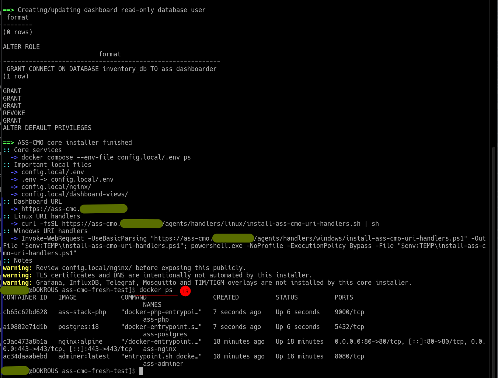

# ASS-CMO

**Admins Secure Server Connection Manager & Overview**

ASS-CMO is a small, self-hosted server inventory, overview, enrollment, and connection-launcher dashboard for administrators.

The long-term idea is to grow into a practical replacement for tools such as PuTTY session lists and Remote Desktop Manager-style connection catalogs. Those tools are useful, but they usually know very little about the machines behind the saved connections. ASS-CMO takes the opposite approach: every machine reports fresh inventory data first, and the dashboard then uses that data to provide useful connection actions, status visibility, and fast navigation.

---

**Project status:** Early public release. The core workflow is installable and usable in day-to-day admin work. The project is still evolving — APIs, config layout, and agent formats may change before a stable 1.0.

**Transparency:** ASS-CMO is an AI-assisted project. A substantial part of the implementation and documentation was produced with the help of AI coding assistants, then reviewed, tested, and curated manually by the maintainer. The codebase is intentionally small and readable so that it can be inspected directly.

**Security note:** ASS-CMO is designed for use inside a trusted admin network and has not undergone a formal security audit. Before exposing any part of the stack outside that boundary, read [SECURITY.md](SECURITY.md).

**License:** [MIT](LICENSE)

---

## What ASS-CMO does

- Collects and stores fresh system inventory from Linux and Windows hosts.
- Provides secure agent enrollment with per-host agent secrets.
- Presents a single admin overview dashboard built on read-only SQL views.
- Launches local SSH, RDP, and web connections straight from the dashboard through workstation URI handlers.
- Offers a fast command launcher (`Ctrl+K` / `Cmd+K`) over the current view.
- Can be installed as a standalone PWA.

## What ASS-CMO is not

- Not a full RMM platform.
- Does not provide arbitrary remote command execution from the server.
- Does not store SSH private keys, RDP passwords, or remote machine credentials.
- Not a multi-tenant SaaS — it is designed for a single administrator or a small trusted admin team.

## Key features

- PostgreSQL inventory database with a one-way agent ingest endpoint.
- PHP dashboard frontend behind an nginx reverse proxy.
- Adminer for database inspection.
- Linux (shell) and Windows (PowerShell) inventory-only agents.
- systemd timer and apt/pacman hooks for Linux agents; Scheduled Task for Windows agents.
- Read-only dashboard SQL views, with table filtering and sorting.
- Theme switcher and PWA metadata.
- SSH / RDP / application action buttons and `assssh://` / `assrdp://` URI handler installers for Linux and Windows.

## How it works

ASS-CMO is built around one central PostgreSQL inventory table. Linux and Windows agents collect system information locally and submit it to the server over HTTPS using a per-host secret provisioned during enrollment. The inventory protocol is one-way: agents report state, and the server never sends commands back.

The dashboard is a presentation layer over the database. It loads read-only SQL views from `config.local/dashboard-views/*.sql`, and each view becomes a dashboard page. The database holds the inventory, SQL defines the views, and the browser displays the result.

For connections, the dashboard generates local links such as `assssh://host` and `assrdp://host`. The administrator registers URI handlers on their own workstation, so clicking a dashboard action opens the matching local SSH, RDP, or web client. ASS-CMO itself never holds remote credentials.

## Screenshots

The installer flow is shown in the [installation guide](INSTALL.md). Example installer screenshots are stored under `docs/images/install/`:

<picture>
  <source media="(prefers-color-scheme: light)" srcset="docs/images/install/light/03-finished-and-verify.png">
  
</picture>

> Dashboard screenshots: _placeholder — to be added._

## Quick start

```bash
git clone https://github.com/kopfik/ass-cmo
cd ass-cmo
sudo ./install.sh
```

The interactive installer prepares local runtime configuration, generates server-side secrets, configures the nginx example, prepares dashboard views, and starts the core stack. Runtime configuration lives in `config.local/.env`.

See **[INSTALL.md](INSTALL.md)** for prerequisites, what the installer asks for, first login, and agent enrollment.

## Documentation

- [INSTALL.md](INSTALL.md) — installation and agent enrollment.
- [TROUBLESHOOTING.md](TROUBLESHOOTING.md) — operational checks and failure diagnosis.
- [SECURITY.md](SECURITY.md) — security model, trust boundaries, and exposure guidance.
- [CHANGELOG.md](CHANGELOG.md) — release history.

## Roadmap

```text
v0.5.x  first installable and usable ASS-CMO version
v0.6.x  dashboard and launcher refinements
v0.7.x  internal releases and hotfixes
v0.8.0  secure enrollment, per-host secrets, revocation, and clean public release
v1.0.0  later stable release
```

## Optional / experimental overlays

ASS-CMO previously included experimental Grafana and TIGM-style monitoring/visualization overlays. These are **no longer part of the supported ASS-CMO core direction** and are not documented here.

Before v1.0.0 they will be removed from the supported core path. The final form is not yet decided — they will either be removed from the repository or moved into an `examples/` / `experiments/` area as unsupported optional extensions. The supported core remains inventory collection and storage, enrollment with per-host agent secrets, the admin overview dashboard, and the local connection launchers.
